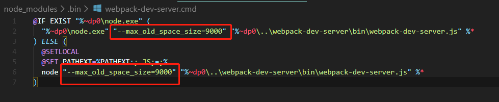

#   内存溢出
*   问题：项目过大
*   解决：
    *   1、
        ```
        于node安装根目录下创建node.cmd文件
        内容为 node.exe --max-old-space=size=8192 %*
        ```
    *   2、
        ```
        于node_modules中的bin目录下的webpack-dev-server.cmd中添加
        "--max-old-space=size-8192"
        
        ```
